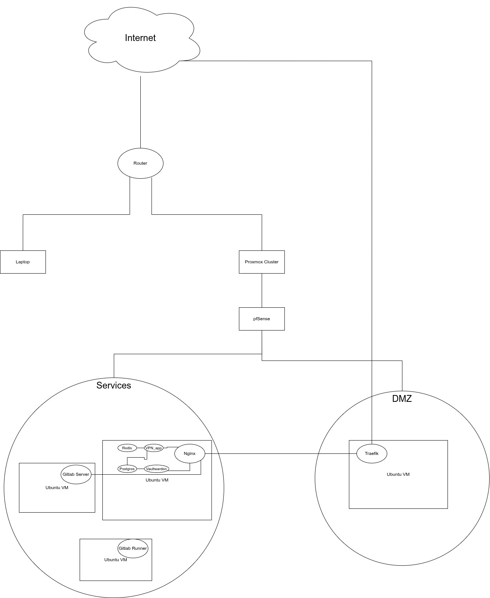

# Private Cloud Infrastructure & DevOps Platform


## 📖 Overview

This repository hosts the source code for a fully automated **Private Cloud Infrastructure**, designed to simulate enterprise-grade environments. The project focuses on **Infrastructure as Code (IaC)**, **Configuration Management**, and **Security Automation**.

The goal is to eliminate manual operations ("ClickOps") by defining the entire datacenter state—from Virtual Machine provisioning to application deployment—as code.

### 🏗 Architecture Highlights

* **Hypervisor:** Proxmox VE (Clustered Environment).
* **Provisioning (IaC):** Polyglot approach using **Pulumi (Python)** for programmatic logic and **Terraform** for declarative state management.
* **Configuration Management:** **Ansible** playbooks for OS hardening, security compliance, and software installation.
* **Network Security:** Strict segmentation (DMZ vs LAN), **mTLS** authentication for internal services, and software-defined firewalls (UFW/pfSense).
* **Application Layer:** Docker-based container orchestration with Traefik as the Ingress Controller/Load Balancer.

---



## 🛠 Technology Stack

| Domain | Tools & Technologies |
| :--- | :--- |
| **Infrastructure Provisioning** | **Pulumi** (Python SDK), **Terraform** (HCL), Proxmox API |
| **Configuration Management** | **Ansible**, Jinja2 Templating, Bash Scripting |
| **Containerization** | Docker, Docker Compose |
| **Networking & Security** | Traefik (Reverse Proxy), OpenSSL (Internal PKI), WireGuard (VPN), UFW |
| **Backend Development** | Python (Django/Flask for custom internal tools), PostgreSQL, Redis |
| **CI/CD** | Git, GitHub Actions (planned) |

---

## 📂 Repository Structure

```text
.
├── Ansible/                 # Configuration Management Layer
│   ├── inventory/           # Dynamic & Static Inventories (Prod/Dev)
│   ├── playbooks/           # Orchestration logic (site.yml)
│   ├── roles/               # Modular roles (Security, Docker, GitLab, etc.)
│   └── certs/               # Internal PKI & mTLS definitions
│
├── Pulumi/                  # Infrastructure as Code (Python)
│   ├── infrastructure/      # VM & LXC Provisioning logic (Proxmox Provider)
│   └── apps/                # Application stack definitions (Custom VPN, DBs)
│
├── Terraform/               # Infrastructure as Code (HCL) - *Alternative Provisioner*
│   ├── modules/             # Reusable infrastructure modules
│   └── main.tf              # State definition for core resources
│
└── orchestrate.py           # Python glue-code for triggering deployment workflows
```

## 🚀 Key Engineering Features
1. Infrastructure as Code (Polymorphic)
I implemented infrastructure provisioning using two different paradigms to demonstrate adaptability:

Python (Pulumi): Allows for complex logic, loops, and external API calls during provisioning.

Terraform: Enforces strict state management and declarative configuration for core resources.

2. Security by Design
Zero-Trust Networking: Internal services communicate via mTLS (Mutual TLS), ensuring that even inside the network, identity is verified.

Automated Hardening: Ansible roles automatically disable root login, configure UFW firewalls, and enforce SSH key-only authentication immediately after provisioning.

3. Custom Internal Tooling
Includes a custom-built VPN Provisioning Application (Python/Django) that allows for self-service VPN access management, integrated directly into the infrastructure stack.

## 💻 Getting Started
Prerequisites
Proxmox VE Cluster (Version 7.x or 8.x)

Python 3.10+

Terraform & Ansible installed locally

#### Deployment Workflow
```
# Using Pulumi:
cd Pulumi/config
# add the configurations to the stack.
# Now, inside Pulumi/config
pulumi up
# Now wait for the config to be done
cd ../infrastructure && pulumi up
# Now wait for the VMs to be provisioned and get configured by ansible (automatically)
cd ../apps && pulumi up
```

#### 🔮 Future Roadmap
[ ] Kubernetes Migration: Moving container workloads from Docker Compose to a K3s cluster.

[ ] Hybrid Cloud: Establishing a Site-to-Site VPN with AWS to extend the private cloud.

[ ] GitOps: Implementing ArgoCD for continuous delivery.