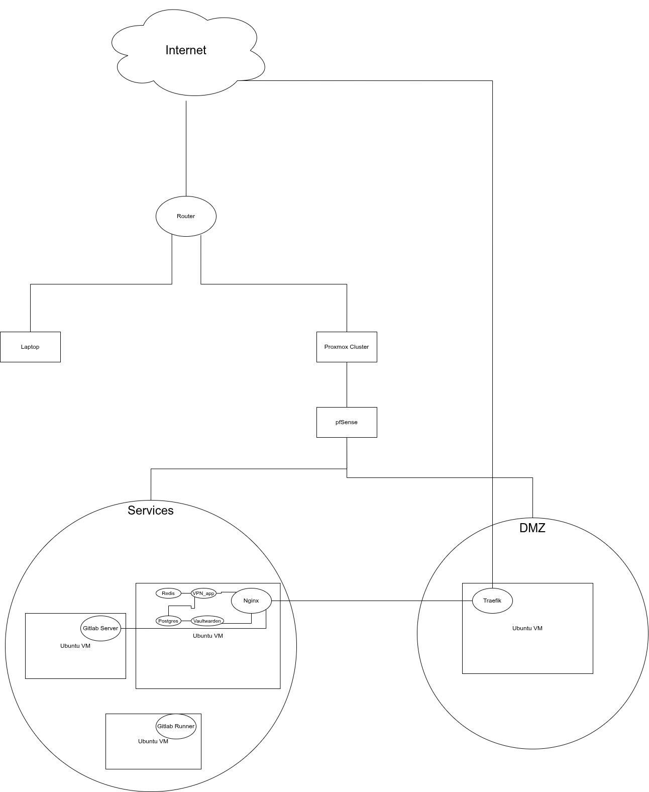

# Private Cloud

A homelab private cloud provisioned end to end from code: Pulumi creates the VMs on Proxmox, Ansible hardens them, and a second Pulumi stack deploys the containers. One command, `orchestrate.py`, runs all three and tears the stack back down if any stage fails.

Built to practise the provisioning, segmentation and hardening work that normally happens by hand, and to have somewhere to break things that is not production.

## Architecture



Two segments behind pfSense:

- **DMZ** — Traefik only. Terminates TLS from the internet with Let's Encrypt certificates, applies rate limiting and security headers, and forwards to the services segment.
- **Services** — Nginx plus the application containers: a Django VPN portal, Vaultwarden, PostgreSQL, Redis, and proxy entries for a GitLab server and runner.

Nothing in the services segment is reachable from the internet directly. The only public entry point is Traefik, and the only public service behind it is the VPN portal, which exists to hand out access to everything else.

## How it runs

```
orchestrate.py
  ├─ Pulumi  (Pulumi/infrastructure)  clone VMs on Proxmox, wait for SSH,
  │                                   generate the Ansible inventory
  ├─ Ansible (Ansible/)               harden the OS, install Docker
  └─ Pulumi  (Pulumi/apps)            build images, deploy containers over
                                      a remote Docker socket via SSH
```

The inventory is generated from the Pulumi stack rather than maintained by hand, so the VMs and the configuration layer cannot drift apart. If the infrastructure stage fails, `orchestrate.py` destroys what it created instead of leaving a half-built stack behind.

`Terraform/` provisions the same kind of VM through a small `proxmox_vm` module. It came first, and Pulumi replaced it once the provisioning logic needed loops and generated files.

## Security

What is actually implemented, and why:

**Egress is filtered, not just ingress.** UFW defaults to deny in both directions. Outbound allows only 80, 443 and 53 for package installs and container pulls, plus 123 and 53 UDP for time and DNS. Most setups leave outbound wide open, which means a compromised container can reach anything; the assumption here is that something will eventually run code it should not, and the interesting question is what it can talk to afterwards. Enabling UFW runs async with a `wait_for_connection` check, so a bad rule does not lock Ansible out of the host.

**TLS inside the network, not just at the edge.** Traefik reaches the services segment over HTTPS and verifies the certificate against an internal root CA, so a rogue host on the services VLAN cannot impersonate Nginx. This is one-way TLS with a private CA, not mTLS: Traefik does not present a client certificate, and Nginx does not require one. Adding that is on the list below.

**The client IP cannot be spoofed.** Traefik discards any `X-Forwarded-For` a client sends and sets it to the peer it observes. The Django portal then counts from the right-hand end of the chain to find the real client. This matters because the portal's rate limiting and IP bans key on that address, and an identifier the client controls makes both useless. See `Pulumi/apps/traefik/traefik.yml` and `core/utils/client_ip.py`.

**Application-level detection and blocking.** The VPN portal ships two middlewares: one logs suspicious activity to a separate security log, one blocks it. Failed codes and failed Django logins increment a Redis counter that bans the IP for 48 hours past a threshold. Scanner user-agents get a 403. Redis being unavailable fails open, on purpose, because a Redis outage should not lock everyone out of the tool they need to reach the network.

**Hardening.** Key-only SSH, root login disabled, Docker configured through a templated `daemon.json`, containers on an internal Docker network with no published ports except on the proxies.

**Secrets.** Kept in Pulumi encrypted config and read through a dedicated config stack, never in the repo. Terraform variable values and TLS private keys are git-ignored.

`Documentation/Security Analysis/` walks through the same ground organised by threat: what the attack is, what control answers it, what it does not cover.

## Layout

```
orchestrate.py         Drives all three stages, with teardown on failure
Pulumi/
  infrastructure/      VM provisioning on Proxmox, inventory generation
  apps/                Container builds and deployment, per-app classes
  configs/             Config stack that holds the encrypted secrets
  Misc/                Scratch stack for one-off VMs
Ansible/
  roles/common/        Firewall, SSH hardening, packages
  roles/docker_host/   Docker install and daemon config
Terraform/             Earlier provisioning path, kept as a reference module
Documentation/         C4 diagrams, install manual, security analysis
```

## Known gaps

- Internal TLS is one-way. Client certificates on the Traefik to Nginx hop, and `ssl_verify_client` on the Nginx side, would make it mutual.
- Nginx reaches the application containers over plain HTTP inside the Docker network.
- No CI. No linting, no `terraform validate`, no secret scanning on commit.
- No monitoring. Deliberate for now, since that is the day job.

## Status

Ran on a 2-node Proxmox VE cluster with a QDevice for quorum and ZFS replication between nodes. That hardware has since been rebuilt on Ubuntu with OpenStack, so the Proxmox provisioning path here is no longer live and the current commit is unverified against a running API. The OpenStack rebuild is in progress.
